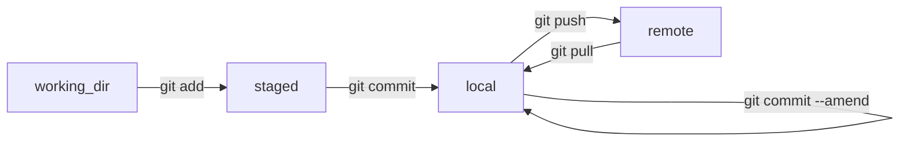

# Git Resources
Commonly used commands, cheat sheets, tools, etc.

## Introduction
Version control with git. Why? How? What else? 

## Model



## Commands
- ```git clone <repo>``` creates a local clone of an existing remote repository.
- ```git log``` show the local and remote commits of the current branch.
- ```git add <file>``` stages an existing file for commit.  
- ```git status``` show the staged files and files with changes.
- ```git commit -m <message>``` cerate a local commit of staged files.
- ```git commit``` create a local commit of staged files with a message interactively written in an editor.
- ```git pull``` pulls new commits from the remote repository to the local repository.
- ```git push``` pushes local commits to the remote repository.

## Branches
...

## Cheat Sheets
[Cheat Sheet #1](https://images.datacamp.com/image/upload/v1656573882/Marketing/Blog/git_cheat_sheet.pdf)

## Simulators
- [https://git-school.github.io/visualizing-git/](https://git-school.github.io/visualizing-git/)
- [https://learngitbranching.js.org/](https://learngitbranching.js.org/)

## Github
A host for remote git repositories which provides numerous additional features/services

### Getting Started
1. Create account.
2. Create organization.
3. Create repositories.
4. Set up SSH keys allow push to remote repo.
   
### Editing
- [Github markdown syntax](https://docs.github.com/en/get-started/writing-on-github/getting-started-with-writing-and-formatting-on-github/basic-writing-and-formatting-syntax)
- [Mermaid diagram intro](https://github.blog/2022-02-14-include-diagrams-markdown-files-mermaid/)
- [Mermaid diagram syntax](https://mermaid.js.org/intro/syntax-reference.html)

### Github Actions
Github Actions is Github's CI/CD system which can be used for building, testing, and deploying software, but also for other automation tasks. 
- [Quick Start](https://docs.github.com/en/actions/quickstart)
- [Workflows](https://docs.github.com/en/actions/using-workflows)
- [Github Actions with MATLAB](https://www.mathworks.com/videos/how-to-run-matlab-in-github-actions-1680591754005.html)

